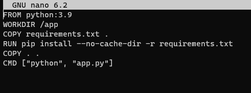
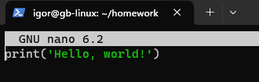
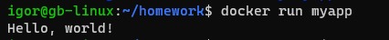

Задание: необходимо создать Dockerfile, основанный на любом образе (вы в праве выбрать самостоятельно).
В него необходимо поместить приложение, написанное на любом известном вам языке программирования (Python, Java, C, С#, C++).
При запуске контейнера должно запускаться самостоятельно написанное приложение.

1. igor@gb-linux:~$ mkdir homework
2. igor@gb-linux:~/homework$ nano dockerfile

    

3. igor@gb-linux:~/homework$ touch app.py

    

4. igor@gb-linux:~/homework$ touch requirements.txt

5. igor@gb-linux:~/homework$ docker build -t myapp .

6.   
